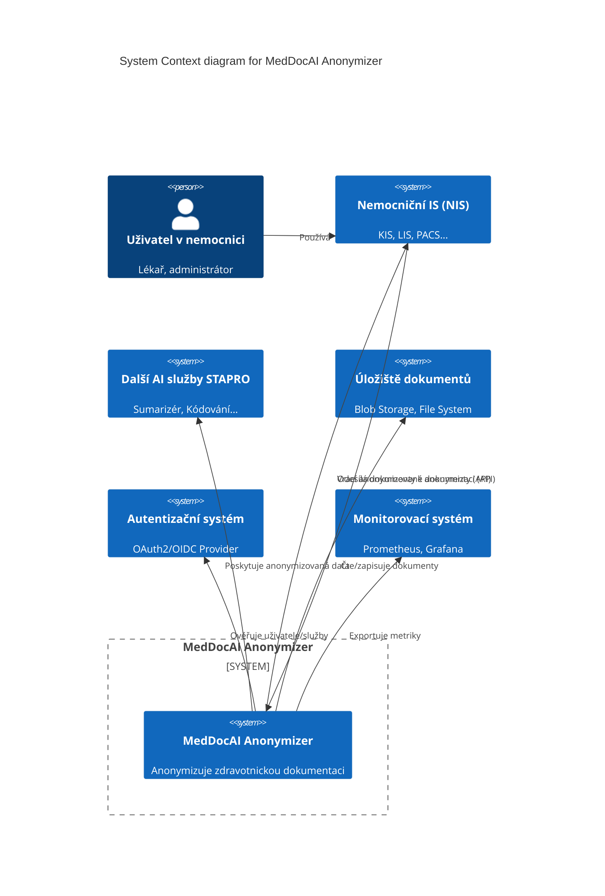
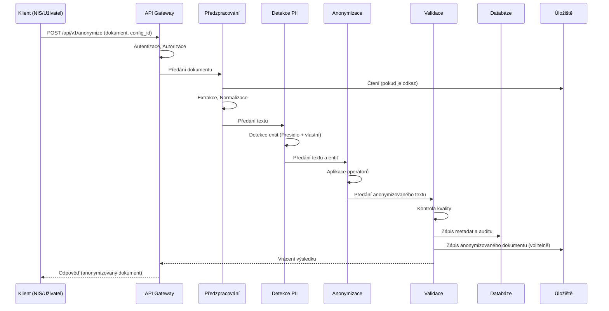
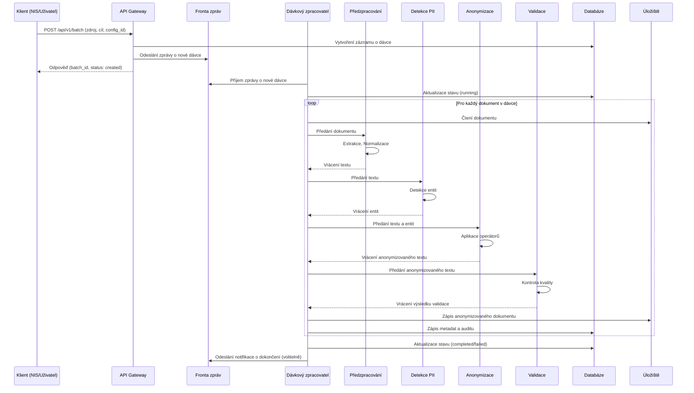

# Technická dokumentace MedDocAI Anonymizer

## Obsah
1. [Úvod](#úvod)
2. [Architektura systému](#architektura-systému)
   - [Přehled architektury](#přehled-architektury)
   - [Detailní popis komponent](#detailní-popis-komponent)
   - [Varianty nasazení](#varianty-nasazení)
3. [Workflow a tok dat](#workflow-a-tok-dat)
   - [Celkový tok dat](#celkový-tok-dat)
   - [Detailní workflow anonymizace](#detailní-workflow-anonymizace)
4. [API specifikace](#api-specifikace)
   - [Anonymizační API](#anonymizační-api)
   - [Dávkové zpracování API](#dávkové-zpracování-api)
   - [Konfigurace API](#konfigurace-api)
   - [Autentizace a autorizace](#autentizace-a-autorizace)
5. [Datový model](#datový-model)
   - [Entitní model](#entitní-model)
   - [Schéma databáze](#schéma-databáze)
6. [Technologie a frameworky](#technologie-a-frameworky)
   - [Základní framework](#základní-framework)
   - [NLP model](#nlp-model)
   - [Doplňkové technologie](#doplňkové-technologie)
   - [Infrastruktura](#infrastruktura)
7. [Testování](#testování)
   - [Strategie testování](#strategie-testování)
   - [Typy testů](#typy-testů)
   - [Metriky kvality](#metriky-kvality)
8. [Bezpečnost](#bezpečnost)
   - [Bezpečnostní architektura](#bezpečnostní-architektura)
   - [Ochrana dat](#ochrana-dat)
   - [Audit a logování](#audit-a-logování)
9. [Nasazení a provoz](#nasazení-a-provoz)
   - [CI/CD pipeline](#cicd-pipeline)
   - [Monitoring a alerting](#monitoring-a-alerting)
   - [Zálohování a obnova](#zálohování-a-obnova)

## Úvod

Tato technická dokumentace poskytuje detailní popis architektury, workflow, API, datových modelů, technologií, testování a bezpečnostních aspektů MedDocAI Anonymizeru. Je určena pro vývojový tým, architekty a administrátory systému.

Dokument navazuje na produktovou specifikaci a vývojový plán a slouží jako technický podklad pro implementaci a provoz systému.

## Architektura systému

### Přehled architektury

MedDocAI Anonymizer je navržen jako **modulární, distribuovaný systém založený na mikroslužbách**. Tento přístup zajišťuje škálovatelnost, odolnost a snadnou údržbu.

Základní komponenty komunikují prostřednictvím **REST API** a **asynchronních zpráv** (např. RabbitMQ nebo Kafka) pro dávkové zpracování.

Systém je navržen pro nasazení v **kontejnerizovaném prostředí** (Docker) a orchestraci pomocí **Kubernetes**.

### Detailní popis komponent

```mermaid
C4Container
  title Container diagram for MedDocAI Anonymizer

  Person(hospital_user, "Uživatel v nemocnici", "Lékař, administrátor")
  System(nis, "Nemocniční IS (NIS)", "KIS, LIS, PACS...")
  System(stapro_ai, "Další AI služby STAPRO", "Sumarizér, Kódování...")
  System(storage, "Úložiště dokumentů", "Blob Storage, File System")
  System(auth_sys, "Autentizační systém", "OAuth2/OIDC Provider")
  System(monitoring_sys, "Monitorovací systém", "Prometheus, Grafana")

  System_Boundary(anonymizer_boundary, "MedDocAI Anonymizer") {
    Container(api_gateway, "API Gateway", "Python/FastAPI", "Zpracovává externí API požadavky")
    Container(preprocessing_service, "Služba předzpracování", "Python", "Extrakce textu, normalizace, segmentace")
    Container(detection_service, "Služba detekce PII", "Python/Presidio", "Detekuje PII pomocí Presidio a vlastních modelů")
    Container(anonymization_service, "Služba anonymizace", "Python/Presidio", "Aplikuje anonymizační operátory")
    Container(validation_service, "Služba validace", "Python", "Kontroluje kvalitu anonymizace")
    Container(batch_processor, "Dávkový zpracovatel", "Python/Celery", "Zpracovává dávky dokumentů")
    Container(config_service, "Služba konfigurace", "Python/FastAPI", "Spravuje konfigurace anonymizace")
    ContainerDb(database, "Databáze", "PostgreSQL", "Ukládá metadata, konfigurace, auditní záznamy")
    Container(message_queue, "Fronta zpráv", "RabbitMQ/Kafka", "Zajišťuje asynchronní komunikaci")
  }

  Rel(hospital_user, api_gateway, "Používá API (HTTPS)")
  Rel(nis, api_gateway, "Používá API (HTTPS)")

  Rel(api_gateway, auth_sys, "Ověřuje tokeny")
  Rel(api_gateway, preprocessing_service, "Předává dokumenty (REST/gRPC)")
  Rel(api_gateway, config_service, "Čte konfigurace (REST/gRPC)")
  Rel(api_gateway, batch_processor, "Spouští dávkové úlohy (Message Queue)")

  Rel(preprocessing_service, detection_service, "Předává text (REST/gRPC)")
  Rel(preprocessing_service, storage, "Čte dokumenty")

  Rel(detection_service, anonymization_service, "Předává text a entity (REST/gRPC)")

  Rel(anonymization_service, validation_service, "Předává anonymizovaný text (REST/gRPC)")

  Rel(validation_service, api_gateway, "Vrací výsledek (REST/gRPC)")
  Rel(validation_service, storage, "Zapisuje anonymizované dokumenty")
  Rel(validation_service, database, "Zapisuje metadata")
  Rel(validation_service, stapro_ai, "Poskytuje data")

  Rel(batch_processor, message_queue, "Čte/zapisuje úlohy")
  Rel(batch_processor, preprocessing_service, "Volá službu")
  Rel(batch_processor, detection_service, "Volá službu")
  Rel(batch_processor, anonymization_service, "Volá službu")
  Rel(batch_processor, validation_service, "Volá službu")
  Rel(batch_processor, database, "Aktualizuje stav úloh")

  Rel(config_service, database, "Čte/zapisuje konfigurace")

  System_Boundary(monitoring_boundary, "Monitoring") {
      Rel(api_gateway, monitoring_sys, "Exportuje metriky")
      Rel(preprocessing_service, monitoring_sys, "Exportuje metriky")
      Rel(detection_service, monitoring_sys, "Exportuje metriky")
      Rel(anonymization_service, monitoring_sys, "Exportuje metriky")
      Rel(validation_service, monitoring_sys, "Exportuje metriky")
      Rel(batch_processor, monitoring_sys, "Exportuje metriky")
      Rel(config_service, monitoring_sys, "Exportuje metriky")
      Rel(database, monitoring_sys, "Exportuje metriky")
  }
```

**Popis komponent:**

- **API Gateway**: Vstupní bod pro všechny externí požadavky. Zajišťuje směrování, autentizaci, autorizaci, rate limiting a základní validaci.
- **Služba předzpracování**: Zodpovídá za extrakci textu z různých formátů, normalizaci a segmentaci dokumentů.
- **Služba detekce PII**: Jádro detekce. Využívá Presidio Analyzer, vlastní rozpoznávače a NLP model pro identifikaci citlivých údajů.
- **Služba anonymizace**: Aplikuje zvolené anonymizační strategie a operátory na detekované entity pomocí Presidio Anonymizer.
- **Služba validace**: Provádí kontrolu kvality anonymizovaných dat a detekci reziduálních rizik.
- **Dávkový zpracovatel**: Zpracovává velké objemy dokumentů asynchronně pomocí fronty zpráv.
- **Služba konfigurace**: Spravuje konfigurace anonymizace (pravidla, strategie) a poskytuje je ostatním službám.
- **Databáze**: Ukládá metadata dokumentů, konfigurace, auditní záznamy a stav dávkových úloh.
- **Fronta zpráv**: Zajišťuje asynchronní komunikaci mezi API Gateway a dávkovým zpracovatelem.

### Varianty nasazení

Architektura je navržena tak, aby podporovala všechny tři varianty nasazení:

1.  **Stapro Azure Cloud**: Všechny kontejnery běží v Azure Kubernetes Service (AKS). Databáze může být Azure PostgreSQL, úložiště Azure Blob Storage, fronta Azure Service Bus.
2.  **Stapro Lokální Infrastruktura**: Všechny kontejnery běží v lokálním Kubernetes clusteru nebo Docker Swarm. Databáze PostgreSQL, úložiště NFS/Ceph, fronta RabbitMQ/Kafka běží na lokálních serverech.
3.  **On-premise v Nemocnici**: Podobné jako lokální infrastruktura, ale nasazeno v prostředí nemocnice. Vyžaduje pečlivé zvážení správy a údržby.

## Workflow a tok dat

### Celkový tok dat

(Viz diagram v sekci Architektura řešení)

### Detailní workflow anonymizace (synchronní)

### Detailní workflow anonymizace (asynchronní - dávkové)

## API specifikace

(Detailní specifikace endpointů, request/response formátů, chybových kódů a autentizace bude definována pomocí OpenAPI/Swagger.)

### Anonymizační API

- **POST /api/v1/anonymize**: Anonymizuje jednotlivý dokument.
- **GET /api/v1/recognizers**: Vrací seznam dostupných rozpoznávačů.
- **GET /api/v1/operators**: Vrací seznam dostupných anonymizačních operátorů.

### Dávkové zpracování API

- **POST /api/v1/batch**: Vytvoří novou úlohu dávkového zpracování.
- **GET /api/v1/batch/{batch_id}**: Získá stav konkrétní dávkové úlohy.
- **GET /api/v1/batch**: Získá seznam dávkových úloh.
- **DELETE /api/v1/batch/{batch_id}**: Zruší běžící dávkovou úlohu.

### Konfigurace API

- **POST /api/v1/configurations**: Vytvoří novou konfiguraci anonymizace.
- **GET /api/v1/configurations**: Získá seznam konfigurací.
- **GET /api/v1/configurations/{config_id}**: Získá detail konkrétní konfigurace.
- **PUT /api/v1/configurations/{config_id}**: Aktualizuje existující konfiguraci.
- **DELETE /api/v1/configurations/{config_id}**: Smaže konfiguraci.

### Autentizace a autorizace

- **Autentizace**: Doporučeno OAuth 2.0 (Client Credentials flow pro M2M komunikaci, Authorization Code flow pro uživatele).
- **Autorizace**: JWT tokeny obsahující role a oprávnění. API Gateway ověřuje token a vynucuje oprávnění pro každý endpoint.

## Datový model

(Viz sekce Datový model v produktové specifikaci pro detailní popis entit a schéma databáze.)

## Technologie a frameworky

- **Backend**: Python 3.11+
- **API Framework**: FastAPI
- **Anonymizace**: Microsoft Presidio
- **NLP**: spaCy, Transformers (Hugging Face), Flair
- **Databáze**: PostgreSQL 15+
- **Fronta zpráv**: RabbitMQ / Kafka
- **Kontejnerizace**: Docker
- **Orchestrace**: Kubernetes
- **CI/CD**: GitLab CI / Azure DevOps / Jenkins
- **Monitoring**: Prometheus, Grafana
- **Logování**: ELK Stack (Elasticsearch, Logstash, Kibana) nebo EFK Stack

## Testování

### Strategie testování

- **Test Pyramid**: Důraz na unit testy, následované integračními a end-to-end testy.
- **Automatizace**: Maximální automatizace testů v rámci CI/CD pipeline.
- **Testování založené na rizicích**: Prioritizace testů podle kritičnosti a pravděpodobnosti chyb.
- **Kontinuální testování**: Testování probíhá průběžně během celého vývojového cyklu.

### Typy testů

1.  **Unit testy**: Testování jednotlivých funkcí a tříd v izolaci (pytest).
2.  **Integrační testy**: Testování interakce mezi komponentami a službami (pytest, Docker Compose).
3.  **API testy**: Testování API endpointů (pytest, requests, Postman/Newman).
4.  **End-to-End testy**: Testování kompletního workflow z pohledu uživatele (Playwright, Selenium).
5.  **Výkonnostní testy**: Měření latence, propustnosti a využití zdrojů (Locust, k6).
6.  **Zátěžové testy**: Testování chování systému pod vysokou zátěží.
7.  **Bezpečnostní testy**: SAST, DAST, penetrační testování.
8.  **Testování kvality anonymizace**: Manuální a automatizované testy pro ověření přesnosti a úplnosti anonymizace na referenčních datech.

### Metriky kvality

- **Pokrytí kódu testy**: > 85%
- **Úspěšnost testů v CI/CD**: > 99%
- **Metriky kvality anonymizace**: Precision > 95%, Recall > 98%, F1 > 96%
- **Počet nalezených chyb**: Sledování trendů
- **Hustota chyb**: Počet chyb na KLOC (tisíc řádků kódu)

## Bezpečnost

### Bezpečnostní architektura

- **Defense in Depth**: Vícevrstvá bezpečnostní opatření.
- **Zero Trust**: Ověřování identity a oprávnění při každém přístupu.
- **Network Segmentation**: Oddělení sítí pro různé komponenty a prostředí.
- **Web Application Firewall (WAF)**: Ochrana API Gateway před běžnými webovými útoky.

### Ochrana dat

- **Šifrování**: TLS 1.3+ pro přenos, AES-256 pro data v klidu.
- **Správa klíčů**: Azure Key Vault / HashiCorp Vault.
- **Minimalizace dat**: Ukládání pouze nezbytných dat.
- **Maskování/Tokenizace**: Pro citlivá data v logách a monitoringu.
- **Bezpečné mazání**: Dodržování politik pro uchovávání a mazání dat.

### Audit a logování

- **Centralizované logování**: ELK/EFK Stack.
- **Nezměnitelné auditní záznamy**: Záznam všech relevantních operací.
- **Monitoring bezpečnostních událostí**: Integrace se SIEM.
- **Pravidelné revize logů**.

## Nasazení a provoz

### CI/CD pipeline

- **Automatizované buildy**: Při každém commitu.
- **Automatizované testy**: Unit, integrační, API testy.
- **Statická analýza kódu (SAST)**.
- **Skenování zranitelností závislostí**.
- **Automatizované nasazení**: Do staging a produkčního prostředí (po schválení).
- **Infrastructure as Code (IaC)**: Terraform / Ansible / Pulumi pro správu infrastruktury.

### Monitoring a alerting

- **Monitoring metrik**: Prometheus / Azure Monitor.
- **Vizualizace**: Grafana / Azure Dashboards.
- **Logování**: ELK / EFK / Azure Log Analytics.
- **Alerting**: Alertmanager / Azure Monitor Alerts.
- **Sledování dostupnosti a výkonu**: Syntetické testy, RUM (Real User Monitoring).

### Zálohování a obnova

- **Pravidelné zálohy**: Databáze, konfigurace, úložiště.
- **Testování obnovy**: Pravidelné ověřování funkčnosti záloh.
- **Disaster Recovery plán**: Definice postupů pro obnovu po havárii.
- **RPO (Recovery Point Objective)**: < 5 minut.
- **RTO (Recovery Time Objective)**: < 4 hodiny.
