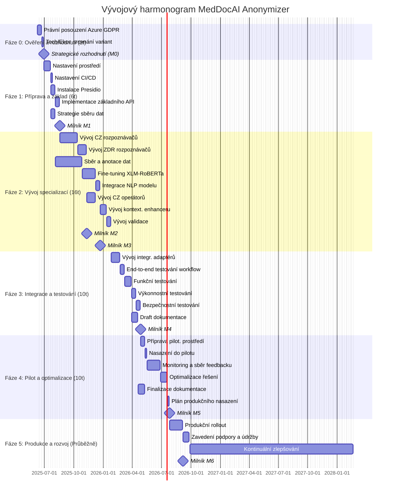

# Vývojový plán a harmonogram MedDocAI Anonymizer

## Obsah
1. [Úvod](#úvod)
2. [Přehled fází projektu](#přehled-fází-projektu)
3. [Detailní plán fází](#detailní-plán-fází)
   - [Fáze 0: Ověření a rozhodnutí o nasazení](#fáze-0-ověření-a-rozhodnutí-o-nasazení)
   - [Fáze 1: Příprava a základní implementace](#fáze-1-příprava-a-základní-implementace)
   - [Fáze 2: Vývoj specializovaných komponent](#fáze-2-vývoj-specializovaných-komponent)
   - [Fáze 3: Integrace a testování](#fáze-3-integrace-a-testování)
   - [Fáze 4: Pilotní nasazení a optimalizace](#fáze-4-pilotní-nasazení-a-optimalizace)
   - [Fáze 5: Plné nasazení a kontinuální zlepšování](#fáze-5-plné-nasazení-a-kontinuální-zlepšování)
4. [Harmonogram projektu (Ganttův diagram)](#harmonogram-projektu-ganttův-diagram)
5. [Potřebné zdroje](#potřebné-zdroje)
6. [Předpoklady a závislosti](#předpoklady-a-závislosti)

## Úvod

Tento dokument popisuje detailní vývojový plán a harmonogram pro projekt MedDocAI Anonymizer. Plán navazuje na finální návrh řešení a produktovou specifikaci a poskytuje roadmapu pro vývojový tým.

Cílem je rozdělit projekt do zvládnutelných fází, definovat klíčové úkoly, výstupy a milníky a stanovit realistický časový rámec pro implementaci.

## Přehled fází projektu

Projekt je rozdělen do následujících šesti hlavních fází:

- **Fáze 0: Ověření a rozhodnutí o nasazení** (Kritická přípravná fáze)
- **Fáze 1: Příprava a základní implementace** (Nastavení prostředí a základů)
- **Fáze 2: Vývoj specializovaných komponent** (Vývoj českých rozšíření a AI modelu)
- **Fáze 3: Integrace a testování** (Propojení systému a komplexní testování)
- **Fáze 4: Pilotní nasazení a optimalizace** (Ověření v reálném provozu)
- **Fáze 5: Plné nasazení a kontinuální zlepšování** (Produkční provoz a další rozvoj)

## Detailní plán fází

### Fáze 0: Ověření a rozhodnutí o nasazení

- **Cíl**: Ověřit klíčové předpoklady (GDPR) a rozhodnout o primární variantě nasazení.
- **Trvání**: 2 týdny
- **Klíčové úkoly**:
    - **Úkol 0.1**: Právní posouzení GDPR kompatibility Microsoft Azure pro zdravotnická data.
    - **Úkol 0.2**: Technicko-ekonomické srovnání variant nasazení (Azure vs. Lokální Stapro).
    - **Úkol 0.3**: Strategické rozhodnutí o primární variantě nasazení.
- **Výstupy**:
    - Závazné stanovisko k Azure GDPR.
    - Srovnávací analýza variant nasazení.
    - Rozhodnutí o primární variantě.
- **Milník M0**: Rozhodnutí o variantě nasazení, GDPR posouzení dokončeno.

### Fáze 1: Příprava a základní implementace

- **Cíl**: Nastavit vývojové prostředí a implementovat základní funkčnost Presidio.
- **Trvání**: 6 týdnů
- **Klíčové úkoly**:
    - **Úkol 1.1**: Nastavení vývojového, testovacího a staging prostředí (dle M0).
    - **Úkol 1.2**: Nastavení CI/CD pipeline.
    - **Úkol 1.3**: Instalace a konfigurace základního frameworku Microsoft Presidio.
    - **Úkol 1.4**: Implementace základních API endpointů (vstup/výstup dokumentů).
    - **Úkol 1.5**: Definice strategie sběru a přípravy dat pro trénink a testování.
- **Výstupy**:
    - Funkční vývojové a testovací prostředí.
    - Základní CI/CD pipeline.
    - Základní Presidio služba s API.
    - Plán pro sběr dat.
- **Milník M1**: Základní Presidio setup funkční, prostředí připraveno.

### Fáze 2: Vývoj specializovaných komponent

- **Cíl**: Vyvinout a integrovat specifická rozšíření pro české zdravotnictví a AI model.
- **Trvání**: 16 týdnů
- **Klíčové úkoly**:
    - **Úkol 2.1**: Vývoj a testování vlastních českých rozpoznávačů (rodná čísla, adresy, IČZ atd.).
    - **Úkol 2.2**: Vývoj a testování rozpoznávačů pro zdravotnické kódy (MKN-10, výkony).
    - **Úkol 2.3**: Sběr a anotace dat pro trénink NLP modelu.
    - **Úkol 2.4**: Fine-tuning a evaluace modelu XLM-RoBERTa pro české zdravotnické texty.
    - **Úkol 2.5**: Integrace fine-tuned modelu do Presidio Analyzeru.
    - **Úkol 2.6**: Implementace vlastních anonymizačních operátorů (např. syntetická jména).
    - **Úkol 2.7**: Implementace kontextového enhanceru pro české texty.
    - **Úkol 2.8**: Implementace validačního modulu.
- **Výstupy**:
    - Sada vlastních českých rozpoznávačů.
    - Fine-tuned NLP model pro české zdravotnictví.
    - Sada vlastních anonymizačních operátorů.
    - Funkční kontextový enhancer.
    - Validacní modul.
- **Milník M2**: Vlastní české rozpoznávače implementovány a otestovány.
- **Milník M3**: Fine-tuned NLP model integrován a evaluován.

### Fáze 3: Integrace a testování

- **Cíl**: Integrovat anonymizér s okolními systémy a provést komplexní testování.
- **Trvání**: 10 týdnů
- **Klíčové úkoly**:
    - **Úkol 3.1**: Vývoj integračních adaptérů pro NIS a úložiště dokumentů.
    - **Úkol 3.2**: Implementace a testování end-to-end workflow.
    - **Úkol 3.3**: Provedení komplexního funkčního testování (dle specifikace).
    - **Úkol 3.4**: Provedení výkonnostního a zátěžového testování.
    - **Úkol 3.5**: Provedení bezpečnostního testování (SAST, DAST, revize kódu).
    - **Úkol 3.6**: Příprava draftů technické a uživatelské dokumentace.
- **Výstupy**:
    - Funkční integrační adaptéry.
    - Výsledky funkčních, výkonnostních a bezpečnostních testů.
    - Drafty dokumentace.
- **Milník M4**: Systém integrovaný, hlavní testovací cykly dokončeny.

### Fáze 4: Pilotní nasazení a optimalizace

- **Cíl**: Ověřit funkčnost a výkon v reálném prostředí a optimalizovat řešení.
- **Trvání**: 10 týdnů
- **Klíčové úkoly**:
    - **Úkol 4.1**: Příprava pilotního prostředí (interní nebo u vybraného zákazníka).
    - **Úkol 4.2**: Nasazení anonymizéru do pilotního prostředí.
    - **Úkol 4.3**: Monitoring výkonu, sběr metrik a uživatelské zpětné vazby.
    - **Úkol 4.4**: Optimalizace modelů, pravidel a konfigurace na základě výsledků pilotu.
    - **Úkol 4.5**: Finalizace dokumentace a příprava školících materiálů.
    - **Úkol 4.6**: Příprava plánu pro produkční nasazení a podporu.
- **Výstupy**:
    - Vyhodnocení pilotního provozu.
    - Optimalizovaná verze anonymizéru.
    - Finální dokumentace a školící materiály.
    - Plán produkčního nasazení.
- **Milník M5**: Pilotní provoz úspěšně dokončen, systém připraven pro produkci.

### Fáze 5: Plné nasazení a kontinuální zlepšování

- **Cíl**: Nasadit řešení do plného produkčního provozu a zajistit jeho dlouhodobý rozvoj.
- **Trvání**: Průběžně
- **Klíčové úkoly**:
    - **Úkol 5.1**: Postupné nasazení do produkčních prostředí (dle plánu).
    - **Úkol 5.2**: Zavedení procesů pro produkční monitoring, podporu a údržbu.
    - **Úkol 5.3**: Implementace strategie pro kontinuální zlepšování (retraining modelů, aktualizace pravidel).
    - **Úkol 5.4**: Pravidelné bezpečnostní audity a revize.
    - **Úkol 5.5**: Sledování metrik a vyhodnocování přínosů.
- **Výstupy**:
    - Anonymizér v plném produkčním provozu.
    - Zavedené procesy podpory a údržby.
    - Plán pro další rozvoj.
- **Milník M6**: Plné produkční nasazení dosaženo.

## Harmonogram projektu (Ganttův diagram)

*Poznámka: Harmonogram je orientační a může se měnit v závislosti na dostupnosti zdrojů a výsledcích jednotlivých fází.* 
*Předpokládané datum zahájení Fáze 0 je 9. června 2025.*
*Předpokládané dosažení Milníku M6 (plné produkční nasazení) je v Q2 2026.*

## Potřebné zdroje

### Tým

- **Projektový manažer / Product Owner**: 1 FTE
- **Softwaroví inženýři (Python)**: 2-3 FTE
- **Data Scientist / NLP specialista**: 1-2 FTE
- **Tester / QA Engineer**: 1 FTE
- **DevOps Engineer**: 0.5 FTE
- **Právní konzultant**: Dle potřeby (Fáze 0)
- **Zdravotnický expert / Klinik**: Dle potřeby (konzultace, validace)

### Infrastruktura

- **Vývojové a testovací prostředí**: Cloudové nebo lokální servery
- **CI/CD nástroje**: Jenkins, GitLab CI, Azure DevOps...
- **GPU zdroje**: Pro trénink a fine-tuning NLP modelů
- **Produkční prostředí**: Dle zvolené varianty nasazení (Azure nebo lokální HW)

### Data

- **Reprezentativní vzorky** české zdravotnické dokumentace pro vývoj a testování
- **Anotovaná data** pro trénink NLP modelu (potenciálně nutné vytvořit)

## Předpoklady a závislosti

### Předpoklady

- Úspěšné dokončení Fáze 0 (ověření GDPR, rozhodnutí o nasazení)
- Dostupnost potřebných zdrojů (tým, infrastruktura, data)
- Spolupráce interních týmů a externích partnerů (nemocnice)
- Stabilita použitého frameworku (Microsoft Presidio)

### Závislosti

- **Externí**: Dostupnost a GDPR kompatibilita Azure služeb (pro Variantu 1)
- **Externí**: Spolupráce nemocnic při poskytování dat a zpětné vazby
- **Interní**: Dostupnost existujících systémů STAPRO pro integraci
- **Interní**: Schválení rozpočtu a zdrojů pro projekt
