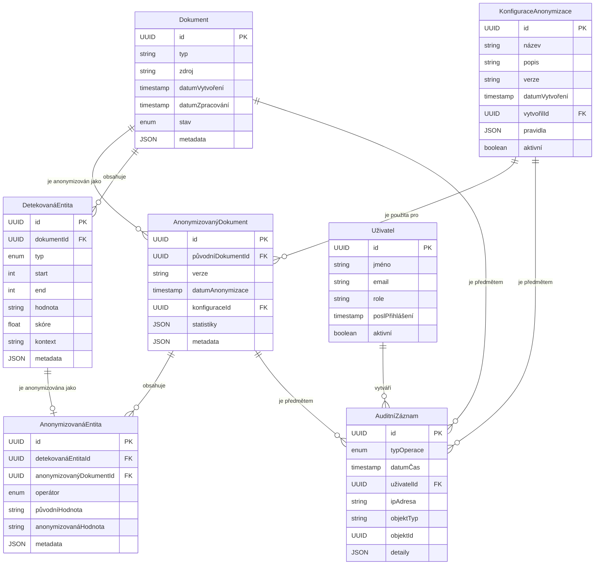

# Produktová specifikace MedDocAI Anonymizer

## Obsah
1. [Přehled produktu](#přehled-produktu)
2. [Cílové skupiny uživatelů](#cílové-skupiny-uživatelů)
3. [Funkční požadavky](#funkční-požadavky)
4. [Nefunkční požadavky](#nefunkční-požadavky)
5. [Omezení a předpoklady](#omezení-a-předpoklady)
6. [Uživatelské scénáře](#uživatelské-scénáře)
7. [Datový model](#datový-model)
8. [Integrační body](#integrační-body)
9. [Bezpečnostní požadavky](#bezpečnostní-požadavky)
10. [Požadavky na výkon](#požadavky-na-výkon)
11. [Lokalizace](#lokalizace)
12. [Požadavky na dokumentaci](#požadavky-na-dokumentaci)

## Přehled produktu

MedDocAI Anonymizer je specializovaný software pro anonymizaci nestrukturované zdravotnické dokumentace v textové podobě. Produkt je navržen jako kritická komponenta v portfoliu AI řešení společnosti STAPRO ve zdravotnictví.

### Účel produktu

Primárním účelem MedDocAI Anonymizeru je identifikace a odstranění nebo transformace osobních identifikačních údajů (PII) a chráněných zdravotních informací (PHI) z lékařských záznamů. Tento proces je zásadní pro bezpečné využití citlivých dat pro sekundární účely, jako je:

- Výzkum a vývoj
- Trénink modelů umělé inteligence
- Iniciativy pro zlepšování kvality zdravotní péče
- Cloudové zpracování dat
- Sdílení dat mezi institucemi

Klíčovou vlastností produktu je zachování klinické relevance dokumentů i po anonymizaci.

### Klíčové vlastnosti

1. **Detekce PII/PHI** - Identifikace osobních údajů v textu pomocí kombinace pravidel, regulárních výrazů a AI
2. **Anonymizace** - Transformace osobních údajů pomocí různých strategií (maskování, redakce, generalizace)
3. **Podpora českého zdravotnictví** - Specializované rozpoznávače pro české formáty identifikátorů a zdravotnickou terminologii
4. **Flexibilní nasazení** - Možnost provozu v cloudu, na lokální infrastruktuře nebo on-premise
5. **API rozhraní** - Integrace s existujícími systémy STAPRO a nemocničními systémy
6. **Auditovatelnost** - Kompletní záznamy o provedených operacích pro účely auditu
7. **Konfigurovatelnost** - Možnost přizpůsobení úrovně a strategie anonymizace podle potřeb

## Cílové skupiny uživatelů

### Primární uživatelé

1. **Nemocnice a zdravotnická zařízení**
   - Potřebují anonymizovat zdravotnickou dokumentaci pro výzkum, výuku nebo sdílení
   - Očekávají snadnou integraci s existujícími systémy
   - Vyžadují vysokou míru bezpečnosti a soulad s GDPR

2. **Výzkumné instituce ve zdravotnictví**
   - Potřebují přístup k anonymizovaným datům pro výzkumné účely
   - Očekávají zachování klinické relevance dat
   - Vyžadují konzistentní anonymizaci napříč dokumenty

3. **Vývojáři AI ve zdravotnictví**
   - Potřebují anonymizovaná data pro trénink AI modelů
   - Očekávají vysokou kvalitu a reprezentativnost dat
   - Vyžadují možnost dávkového zpracování velkých objemů dat

### Sekundární uživatelé

1. **Administrátoři systému**
   - Potřebují nástroje pro monitoring a správu
   - Očekávají snadnou konfiguraci a údržbu
   - Vyžadují přehledné reporty a logy

2. **Auditoři a compliance specialisté**
   - Potřebují důkazy o souladu s GDPR a dalšími regulacemi
   - Očekávají transparentní dokumentaci procesu anonymizace
   - Vyžadují auditní záznamy a reporty

3. **Datový analytici**
   - Potřebují konzistentně anonymizovaná data pro analýzy
   - Očekávají zachování statistických vlastností dat
   - Vyžadují metadata o provedené anonymizaci

## Funkční požadavky

### FR-1: Detekce PII/PHI

#### FR-1.1: Detekce přímých identifikátorů
- Systém musí detekovat následující typy přímých identifikátorů:
  - Jména a příjmení osob
  - Rodná čísla a jejich varianty
  - Čísla pojištěnců
  - Adresy (včetně částečných)
  - Telefonní čísla
  - E-mailové adresy
  - Identifikátory zdravotnických zařízení (IČO, IČZ)
  - Identifikátory zdravotnických pracovníků

#### FR-1.2: Detekce nepřímých identifikátorů
- Systém musí detekovat kombinace údajů, které mohou vést k identifikaci osoby:
  - Věk/datum narození v kombinaci s diagnózou
  - Neobvyklé diagnózy nebo procedury
  - Časové údaje s přesností na den
  - Geografické údaje s přesností na obec/město

#### FR-1.3: Kontextová analýza
- Systém musí využívat kontextové informace pro zpřesnění detekce:
  - Analýza okolního textu
  - Identifikace sekcí dokumentu (hlavička, tělo, závěr)
  - Rozpoznání vztahů mezi entitami

#### FR-1.4: Konfigurovatelná citlivost
- Systém musí umožňovat konfiguraci citlivosti detekce:
  - Nastavení prahových hodnot pro jednotlivé typy entit
  - Možnost prioritizace přesnosti vs. úplnosti
  - Definice vlastních pravidel a vzorů

### FR-2: Anonymizace

#### FR-2.1: Strategie anonymizace
- Systém musí podporovat následující strategie anonymizace:
  - Maskování - nahrazení části údajů zástupnými znaky (např. XXX-XX-1234)
  - Redakce - úplné odstranění údajů
  - Generalizace - snížení granularity údajů (např. věk místo data narození)
  - Perturbace - přidání kontrolovaného šumu
  - Syntetizace - nahrazení realistickými, ale fiktivními údaji

#### FR-2.2: Konfigurace anonymizace
- Systém musí umožňovat konfiguraci anonymizace pro různé typy entit:
  - Výběr strategie pro každý typ entity
  - Nastavení parametrů anonymizace (např. počet maskovaných znaků)
  - Definice vlastních operátorů anonymizace

#### FR-2.3: Konzistence anonymizace
- Systém musí zajistit konzistentní anonymizaci napříč dokumenty:
  - Stejná entita musí být anonymizována stejným způsobem v rámci dokumentu
  - Volitelně: stejná entita musí být anonymizována stejným způsobem napříč dokumenty

#### FR-2.4: Reverzibilní anonymizace
- Systém musí volitelně podporovat reverzibilní anonymizaci:
  - Šifrování údajů s možností deanonymizace
  - Bezpečné uložení klíčů
  - Striktní kontrola přístupu k deanonymizaci

### FR-3: Zpracování dokumentů

#### FR-3.1: Podpora formátů
- Systém musí podporovat následující formáty dokumentů:
  - Prostý text (TXT)
  - Strukturovaný text (XML, JSON)
  - Dokumenty (PDF, DOC, DOCX)
  - Zdravotnické formáty (HL7, DICOM)

#### FR-3.2: Extrakce textu
- Systém musí umět extrahovat text z různých formátů:
  - Parsování strukturovaných formátů
  - Extrakce textu z dokumentů
  - OCR pro naskenované dokumenty

#### FR-3.3: Segmentace dokumentů
- Systém musí umět segmentovat dokumenty na logické části:
  - Hlavička (metadata)
  - Tělo dokumentu
  - Závěr
  - Přílohy

#### FR-3.4: Zachování struktury
- Systém musí zachovat strukturu dokumentu po anonymizaci:
  - Formátování textu
  - Odstavce a sekce
  - Tabulky a seznamy

### FR-4: Integrace a rozhraní

#### FR-4.1: API rozhraní
- Systém musí poskytovat REST API pro:
  - Synchronní zpracování jednotlivých dokumentů
  - Asynchronní zpracování dávek dokumentů
  - Správu a konfiguraci

#### FR-4.2: Integrační adaptéry
- Systém musí poskytovat adaptéry pro integraci s:
  - Nemocničními informačními systémy
  - Existujícími systémy STAPRO
  - Úložišti dokumentů

#### FR-4.3: Dávkové zpracování
- Systém musí podporovat dávkové zpracování:
  - Import a export dávek dokumentů
  - Paralelní zpracování
  - Monitoring průběhu a reportování výsledků

#### FR-4.4: Notifikace
- Systém musí poskytovat notifikace o:
  - Dokončení zpracování
  - Chybách a varováních
  - Dosažení limitů nebo prahových hodnot

### FR-5: Správa a monitoring

#### FR-5.1: Konfigurace systému
- Systém musí umožňovat konfiguraci:
  - Globálních nastavení
  - Nastavení pro jednotlivé typy dokumentů
  - Nastavení pro jednotlivé zákazníky/projekty

#### FR-5.2: Monitoring
- Systém musí poskytovat monitoring:
  - Stavu služby
  - Výkonu a využití zdrojů
  - Statistik zpracování

#### FR-5.3: Logování a audit
- Systém musí poskytovat kompletní logování:
  - Operační logy
  - Auditní záznamy
  - Chybové logy

#### FR-5.4: Reportování
- Systém musí generovat reporty:
  - Statistiky zpracování
  - Metriky kvality anonymizace
  - Compliance reporty

### FR-6: Validace a vyhodnocení

#### FR-6.1: Kontrola kvality
- Systém musí provádět kontrolu kvality anonymizace:
  - Detekce potenciálně přehlédnutých PII
  - Kontrola konzistence anonymizace
  - Validace proti definovaným pravidlům

#### FR-6.2: Metriky
- Systém musí poskytovat metriky:
  - Přesnost a úplnost detekce
  - Míra zachování klinické relevance
  - Výkonnostní metriky

#### FR-6.3: Zpětná vazba
- Systém musí umožňovat zpětnou vazbu:
  - Označení falešně pozitivních detekcí
  - Označení přehlédnutých PII
  - Využití zpětné vazby pro zlepšení

## Nefunkční požadavky

### NFR-1: Výkon a škálovatelnost

#### NFR-1.1: Latence
- Systém musí zpracovat jednotlivý dokument (do 10 stran) v čase pod 500 ms
- Systém musí zpracovat dávku 1000 dokumentů v čase pod 10 minut

#### NFR-1.2: Propustnost
- Systém musí zvládnout zpracovat minimálně 10 dokumentů za sekundu na jednu instanci
- Systém musí zvládnout zpracovat minimálně 100 000 dokumentů denně

#### NFR-1.3: Škálovatelnost
- Systém musí podporovat horizontální škálování pro zvýšení propustnosti
- Systém musí efektivně využívat dostupné výpočetní zdroje

#### NFR-1.4: Dostupnost
- Systém musí být dostupný 99.9% času (maximálně 8.76 hodin výpadků ročně)
- Plánované výpadky musí být omezeny na mimopracovní dobu

### NFR-2: Bezpečnost a soulad s regulacemi

#### NFR-2.1: Soulad s GDPR
- Systém musí být v plném souladu s GDPR a dalšími relevantními regulacemi
- Systém musí implementovat principy Privacy by Design a Privacy by Default

#### NFR-2.2: Zabezpečení dat
- Veškerá komunikace musí být šifrována (TLS 1.3 nebo vyšší)
- Data v klidu musí být šifrována (AES-256 nebo ekvivalent)
- Přístup k datům musí být striktně kontrolován a logován

#### NFR-2.3: Autentizace a autorizace
- Systém musí vyžadovat silnou autentizaci (min. 2FA pro administrátorský přístup)
- Systém musí implementovat granulární řízení přístupu založené na rolích (RBAC)
- Systém musí podporovat integraci s existujícími IAM systémy

#### NFR-2.4: Auditovatelnost
- Systém musí zaznamenávat všechny operace s osobními údaji
- Auditní záznamy musí být nezměnitelné a chráněné proti manipulaci
- Auditní záznamy musí obsahovat informace o kdo, co, kdy, kde a proč

### NFR-3: Spolehlivost a odolnost

#### NFR-3.1: Odolnost proti chybám
- Systém musí být odolný vůči výpadkům jednotlivých komponent
- Systém musí implementovat mechanismy pro detekci a zotavení z chyb
- Systém musí zajistit konzistenci dat i v případě chyb

#### NFR-3.2: Zálohování a obnova
- Systém musí podporovat pravidelné zálohování konfigurace a metadat
- Systém musí umožňovat rychlou obnovu v případě havárie
- Systém musí minimalizovat ztrátu dat v případě havárie (RPO < 5 minut)

#### NFR-3.3: Monitoring a alerting
- Systém musí poskytovat komplexní monitoring všech komponent
- Systém musí generovat alerty při detekci problémů
- Systém musí umožňovat proaktivní řešení problémů

### NFR-4: Použitelnost a přístupnost

#### NFR-4.1: Uživatelské rozhraní
- Administrační rozhraní musí být intuitivní a snadno použitelné
- Rozhraní musí poskytovat jasnou zpětnou vazbu o prováděných operacích
- Rozhraní musí minimalizovat možnost uživatelských chyb

#### NFR-4.2: Dokumentace
- Systém musí být dodán s kompletní dokumentací:
  - Uživatelská příručka
  - Administrátorská příručka
  - API dokumentace
  - Instalační a konfigurační příručka

#### NFR-4.3: Lokalizace
- Uživatelské rozhraní musí být lokalizováno do češtiny a angličtiny
- Systém musí podporovat lokalizaci chybových hlášek a notifikací
- Systém musí správně pracovat s českými znaky a specifiky

### NFR-5: Udržitelnost a rozšiřitelnost

#### NFR-5.1: Modularita
- Systém musí být navržen modulárně s jasně definovanými rozhraními
- Komponenty musí být volně spojené (loosely coupled)
- Změny v jedné komponentě by neměly vyžadovat změny v jiných komponentách

#### NFR-5.2: Rozšiřitelnost
- Systém musí umožňovat snadné přidávání nových typů entit
- Systém musí umožňovat implementaci nových strategií anonymizace
- Systém musí umožňovat integraci s novými zdroji dat a systémy

#### NFR-5.3: Testovatelnost
- Systém musí být navržen s ohledem na testovatelnost
- Systém musí poskytovat nástroje pro automatizované testování
- Systém musí umožňovat izolované testování jednotlivých komponent

#### NFR-5.4: Verzování
- Systém musí podporovat verzování konfigurace a pravidel
- Systém musí umožňovat rollback na předchozí verze
- Systém musí zajistit zpětnou kompatibilitu API

## Omezení a předpoklady

### Omezení

1. **Technologická omezení**
   - Systém musí být implementován v jazyce Python
   - Systém musí využívat Microsoft Presidio jako základní framework
   - Systém musí být nasaditelný v prostředí Kubernetes

2. **Právní omezení**
   - Systém musí být v souladu s GDPR a dalšími relevantními regulacemi
   - Systém musí respektovat licenční podmínky použitých komponent
   - Systém nesmí odesílat data mimo EU bez explicitního souhlasu

3. **Organizační omezení**
   - Vývoj musí probíhat v souladu s interními procesy STAPRO
   - Systém musí být integrován s existujícími systémy STAPRO
   - Systém musí respektovat existující infrastrukturu a architekturu

### Předpoklady

1. **Technické předpoklady**
   - Dostupnost výpočetních zdrojů pro trénink a provoz NLP modelů
   - Dostupnost kvalitních dat pro trénink a testování
   - Dostupnost expertízy v oblasti NLP a anonymizace

2. **Organizační předpoklady**
   - Dostupnost klíčových stakeholderů pro konzultace a rozhodování
   - Dostupnost zdravotnických expertů pro validaci
   - Podpora managementu pro projekt

3. **Externí předpoklady**
   - Stabilita regulatorního prostředí
   - Dostupnost externích služeb a komponent
   - Spolupráce nemocnic a zdravotnických zařízení

## Uživatelské scénáře

### US-1: Anonymizace propouštěcí zprávy

**Aktér**: Lékař v nemocnici

**Popis**: Lékař potřebuje anonymizovat propouštěcí zprávu pacienta pro účely výzkumu.

**Předpoklady**:
- Lékař má přístup k systému
- Propouštěcí zpráva je v elektronické podobě

**Hlavní scénář**:
1. Lékař vybere propouštěcí zprávu v nemocničním informačním systému
2. Lékař zvolí funkci "Anonymizovat pro výzkum"
3. Systém zpracuje dokument a identifikuje PII/PHI
4. Systém zobrazí náhled anonymizovaného dokumentu
5. Lékař zkontroluje náhled a potvrdí anonymizaci
6. Systém uloží anonymizovanou verzi dokumentu
7. Systém poskytne lékaři odkaz na anonymizovaný dokument

**Alternativní scénáře**:
- Pokud systém detekuje potenciálně přehlédnuté PII, upozorní lékaře a požádá o kontrolu
- Pokud lékař není spokojen s anonymizací, může upravit nastavení a spustit proces znovu

### US-2: Dávkové zpracování dokumentů pro AI trénink

**Aktér**: Data scientist

**Popis**: Data scientist potřebuje anonymizovat velkou sadu zdravotnických dokumentů pro trénink AI modelu.

**Předpoklady**:
- Data scientist má přístup k systému
- Dokumenty jsou uloženy v centrálním úložišti

**Hlavní scénář**:
1. Data scientist vytvoří novou úlohu dávkového zpracování
2. Data scientist specifikuje zdroj dokumentů (cesta k úložišti)
3. Data scientist konfiguruje parametry anonymizace (úroveň, strategie)
4. Data scientist spustí dávkové zpracování
5. Systém zpracuje dokumenty paralelně
6. Systém průběžně aktualizuje stav zpracování
7. Po dokončení systém notifikuje data scientistu
8. Data scientist stáhne anonymizovaná data pro trénink AI

**Alternativní scénáře**:
- Pokud zpracování selže, systém poskytne detailní informace o chybě
- Data scientist může pozastavit a později obnovit zpracování

### US-3: Integrace anonymizace do workflow nemocnice

**Aktér**: Administrátor systému

**Popis**: Administrátor potřebuje nastavit automatickou anonymizaci dokumentů v rámci workflow nemocnice.

**Předpoklady**:
- Administrátor má přístup k systému
- Nemocniční systém podporuje integraci přes API

**Hlavní scénář**:
1. Administrátor vytvoří novou konfiguraci anonymizace
2. Administrátor specifikuje typy dokumentů pro anonymizaci
3. Administrátor konfiguruje pravidla anonymizace pro každý typ dokumentu
4. Administrátor nastavuje integrační body s nemocničním systémem
5. Administrátor testuje integraci na vzorových datech
6. Administrátor aktivuje automatickou anonymizaci
7. Systém začne automaticky anonymizovat dokumenty podle nastavených pravidel

**Alternativní scénáře**:
- Pokud test integrace selže, systém poskytne diagnostické informace
- Administrátor může nastavit notifikace pro případy, kdy anonymizace selže

### US-4: Audit anonymizačního procesu

**Aktér**: Compliance specialista

**Popis**: Compliance specialista potřebuje provést audit anonymizačního procesu pro zajištění souladu s GDPR.

**Předpoklady**:
- Compliance specialista má přístup k systému
- Anonymizační proces byl používán po určitou dobu

**Hlavní scénář**:
1. Compliance specialista přistupuje k modulu pro audit
2. Compliance specialista specifikuje časové období pro audit
3. Systém generuje auditní report obsahující:
   - Statistiky zpracování
   - Seznam zpracovaných dokumentů
   - Použité konfigurace anonymizace
   - Záznamy o přístupu k systému
4. Compliance specialista exportuje report pro dokumentaci
5. Compliance specialista identifikuje potenciální problémy
6. Systém umožňuje detailní prozkoumání jednotlivých operací

**Alternativní scénáře**:
- Pokud jsou identifikovány problémy, compliance specialista může vytvořit úkoly pro nápravu
- Compliance specialista může generovat specializované reporty pro různé aspekty anonymizace

### US-5: Vylepšení detekce PII na základě zpětné vazby

**Aktér**: Správce systému

**Popis**: Správce systému potřebuje vylepšit detekci PII na základě zpětné vazby od uživatelů.

**Předpoklady**:
- Správce má přístup k systému
- Uživatelé poskytli zpětnou vazbu o falešně pozitivních/negativních detekcích

**Hlavní scénář**:
1. Správce přistupuje k modulu pro správu pravidel detekce
2. Správce analyzuje zpětnou vazbu od uživatelů
3. Správce identifikuje vzory v problematických detekcích
4. Správce upravuje existující pravidla nebo vytváří nová
5. Správce testuje upravená pravidla na testovací sadě
6. Správce nasazuje aktualizovaná pravidla do produkce
7. Systém začne používat nová pravidla pro detekci PII

**Alternativní scénáře**:
- Pokud testování odhalí problémy, správce může pravidla dále upravit
- Správce může rozhodnout o potřebě přetrénování NLP modelu

## Datový model

### Entitní model

#### Dokument
- ID dokumentu (UUID)
- Typ dokumentu (enum)
- Zdroj (reference)
- Datum vytvoření (timestamp)
- Datum zpracování (timestamp)
- Stav zpracování (enum)
- Metadata (JSON)

#### AnonymizovanýDokument
- ID dokumentu (UUID)
- Reference na původní dokument (UUID)
- Verze anonymizace (string)
- Datum anonymizace (timestamp)
- Použitá konfigurace (reference)
- Statistiky anonymizace (JSON)
- Metadata (JSON)

#### DetekovanáEntita
- ID entity (UUID)
- Typ entity (enum)
- Pozice v dokumentu (start, end)
- Hodnota (string)
- Skóre detekce (float)
- Kontext (string)
- Metadata (JSON)

#### AnonymizovanáEntita
- ID entity (UUID)
- Reference na detekovanou entitu (UUID)
- Použitý operátor (enum)
- Původní hodnota (šifrovaná, volitelně)
- Anonymizovaná hodnota (string)
- Metadata (JSON)

#### KonfiguraceAnonymizace
- ID konfigurace (UUID)
- Název konfigurace (string)
- Popis (string)
- Verze (string)
- Datum vytvoření (timestamp)
- Vytvořil (reference)
- Pravidla (JSON)
- Aktivní (boolean)

#### AuditníZáznam
- ID záznamu (UUID)
- Typ operace (enum)
- Datum a čas (timestamp)
- Uživatel (reference)
- IP adresa (string)
- Objekt operace (reference)
- Detaily operace (JSON)

### Schéma databáze



## Integrační body

### Externí API

#### Anonymizační API

**Endpoint**: `/api/v1/anonymize`

**Metoda**: POST

**Popis**: Anonymizuje jednotlivý dokument

**Požadavek**:
```json
{
  "document": {
    "content": "string",
    "content_type": "text/plain",
    "metadata": {}
  },
  "configuration_id": "uuid",
  "options": {
    "return_detected_entities": true,
    "return_statistics": true
  }
}
```

**Odpověď**:
```json
{
  "anonymized_document": {
    "content": "string",
    "content_type": "text/plain",
    "metadata": {}
  },
  "statistics": {
    "total_entities_detected": 10,
    "entities_by_type": {
      "PERSON": 3,
      "CZECH_BIRTH_NUMBER": 1,
      "ADDRESS": 2
    },
    "processing_time_ms": 120
  },
  "detected_entities": [
    {
      "type": "PERSON",
      "start": 10,
      "end": 20,
      "score": 0.95,
      "anonymized_value": "[PACIENT]"
    }
  ]
}
```

#### Dávkové zpracování API

**Endpoint**: `/api/v1/batch`

**Metoda**: POST

**Popis**: Vytvoří novou úlohu dávkového zpracování

**Požadavek**:
```json
{
  "source": {
    "type": "file_system",
    "path": "/data/documents",
    "file_pattern": "*.pdf"
  },
  "destination": {
    "type": "file_system",
    "path": "/data/anonymized"
  },
  "configuration_id": "uuid",
  "options": {
    "parallel_processing": true,
    "max_workers": 4
  }
}
```

**Odpověď**:
```json
{
  "batch_id": "uuid",
  "status": "created",
  "estimated_documents": 1000,
  "created_at": "2025-06-05T12:00:00Z"
}
```

#### Konfigurace API

**Endpoint**: `/api/v1/configurations`

**Metoda**: GET

**Popis**: Získá seznam konfigurací anonymizace

**Odpověď**:
```json
{
  "configurations": [
    {
      "id": "uuid",
      "name": "Standardní anonymizace",
      "description": "Standardní konfigurace pro anonymizaci zdravotnické dokumentace",
      "version": "1.0.0",
      "created_at": "2025-06-01T12:00:00Z",
      "created_by": "admin",
      "active": true
    }
  ],
  "total": 1,
  "page": 1,
  "page_size": 10
}
```

### Integrační adaptéry

#### Nemocniční informační systém (NIS)

**Typ integrace**: REST API, SOAP, HL7 FHIR

**Směr**: Obousměrný

**Popis**: Integrace s nemocničním informačním systémem pro anonymizaci dokumentů

**Funkce**:
- Příjem dokumentů z NIS
- Anonymizace dokumentů
- Vrácení anonymizovaných dokumentů do NIS
- Notifikace o dokončení anonymizace

#### Úložiště dokumentů

**Typ integrace**: Souborový systém, S3, Azure Blob Storage

**Směr**: Obousměrný

**Popis**: Integrace s úložištěm dokumentů pro dávkové zpracování

**Funkce**:
- Čtení dokumentů z úložiště
- Zápis anonymizovaných dokumentů do úložiště
- Správa verzí dokumentů

#### Monitorovací systém

**Typ integrace**: Prometheus, Grafana

**Směr**: Jednosměrný (export)

**Popis**: Integrace s monitorovacím systémem pro sledování výkonu a stavu služby

**Funkce**:
- Export metrik výkonu
- Export metrik využití zdrojů
- Export business metrik (počet zpracovaných dokumentů, úspěšnost anonymizace)

#### Autentizační systém

**Typ integrace**: OAuth 2.0, OIDC, LDAP

**Směr**: Jednosměrný (import)

**Popis**: Integrace s autentizačním systémem pro ověření identity uživatelů

**Funkce**:
- Ověření identity uživatelů
- Získání rolí a oprávnění
- Single Sign-On (SSO)

## Bezpečnostní požadavky

### Autentizace a autorizace

1. **Silná autentizace**
   - Minimálně dvoufaktorová autentizace pro administrátorský přístup
   - Podpora standardů OAuth 2.0 a OpenID Connect
   - Automatické odhlášení po době nečinnosti (max. 30 minut)

2. **Řízení přístupu založené na rolích (RBAC)**
   - Definice rolí s různými úrovněmi oprávnění
   - Princip nejnižších oprávnění (least privilege)
   - Separace povinností (segregation of duties)

3. **API zabezpečení**
   - Autentizace pomocí API klíčů nebo JWT tokenů
   - Rate limiting pro prevenci zneužití
   - Validace vstupů a ochrana proti injekčním útokům

### Ochrana dat

1. **Šifrování dat v přenosu**
   - TLS 1.3 nebo vyšší pro všechny síťové komunikace
   - Silné šifrovací algoritmy (AES-256, RSA-2048)
   - Pravidelná rotace certifikátů

2. **Šifrování dat v klidu**
   - Šifrování databáze a souborového systému
   - Bezpečná správa klíčů (KMS)
   - Šifrování záloh

3. **Ochrana citlivých dat**
   - Minimalizace ukládání citlivých dat
   - Pseudonymizace nebo tokenizace tam, kde je to možné
   - Bezpečné mazání dat po uplynutí doby uchovávání

### Audit a logování

1. **Auditní záznamy**
   - Logování všech bezpečnostně relevantních událostí
   - Nezměnitelnost auditních záznamů
   - Centralizované ukládání logů

2. **Monitoring bezpečnostních událostí**
   - Detekce anomálií a podezřelých aktivit
   - Alerting při bezpečnostních incidentech
   - Integrace s SIEM systémy

3. **Forenzní analýza**
   - Dostatečná granularita logů pro forenzní analýzu
   - Časová synchronizace všech komponent
   - Uchovávání logů po dostatečnou dobu (min. 1 rok)

### Bezpečnostní testování

1. **Statická analýza kódu (SAST)**
   - Pravidelná analýza zdrojového kódu
   - Kontrola na známé zranitelnosti
   - Dodržování bezpečnostních best practices

2. **Dynamické testování (DAST)**
   - Penetrační testování
   - Fuzzing testování
   - Testování odolnosti proti útokům

3. **Bezpečnostní audity**
   - Pravidelné bezpečnostní audity (min. 1x ročně)
   - Kontrola souladu s bezpečnostními standardy
   - Nezávislé hodnocení bezpečnosti

## Požadavky na výkon

### Latence

1. **Zpracování jednotlivých dokumentů**
   - Průměrná latence: < 500 ms
   - 95. percentil: < 1000 ms
   - 99. percentil: < 2000 ms

2. **Dávkové zpracování**
   - Propustnost: > 10 dokumentů/s na instanci
   - Škálovatelnost: lineární s počtem instancí

### Propustnost

1. **API endpoints**
   - Minimálně 100 požadavků za sekundu
   - Burst capacity: 500 požadavků za sekundu

2. **Dávkové zpracování**
   - Minimálně 100 000 dokumentů denně
   - Paralelní zpracování minimálně 10 dávek současně

### Škálovatelnost

1. **Horizontální škálování**
   - Automatické škálování podle zátěže
   - Přidání nové instance < 5 minut
   - Lineární nárůst výkonu s počtem instancí

2. **Vertikální škálování**
   - Efektivní využití dostupných zdrojů
   - Podpora různých velikostí instancí
   - Optimalizace pro GPU akceleraci (volitelně)

### Dostupnost

1. **SLA**
   - Dostupnost služby: 99.9% (maximálně 8.76 hodin výpadků ročně)
   - Plánované výpadky: pouze mimo pracovní dobu

2. **Odolnost**
   - Automatické zotavení z chyb
   - Graceful degradation při přetížení
   - Geografická redundance (volitelně)

## Lokalizace

### Podporované jazyky

1. **Uživatelské rozhraní**
   - Čeština (primární)
   - Angličtina (sekundární)

2. **Dokumentace**
   - Čeština (primární)
   - Angličtina (sekundární)

3. **Chybové hlášky a notifikace**
   - Čeština (primární)
   - Angličtina (sekundární)

### Specifika pro české prostředí

1. **Formáty identifikátorů**
   - Rodná čísla (včetně variant)
   - Čísla pojištěnců
   - IČO, IČZ, IČP
   - České formáty adres a PSČ

2. **Zdravotnická terminologie**
   - Podpora české zdravotnické terminologie
   - Kódy diagnóz podle MKN-10
   - Kódy výkonů podle Seznamu zdravotních výkonů

3. **Jazykové specifika**
   - Správné zpracování diakritiky
   - Skloňování a časování
   - Detekce jmen a příjmení v různých pádech

## Požadavky na dokumentaci

### Uživatelská dokumentace

1. **Uživatelská příručka**
   - Popis všech funkcí systému
   - Návody krok za krokem
   - Řešení běžných problémů

2. **Administrátorská příručka**
   - Instalace a konfigurace
   - Správa a monitoring
   - Řešení problémů a troubleshooting

3. **Integrační příručka**
   - Popis API a integračních bodů
   - Příklady integrace
   - Bezpečnostní doporučení

### Technická dokumentace

1. **Architektonická dokumentace**
   - Popis architektury systému
   - Komponenty a jejich interakce
   - Datový model a toky dat

2. **API dokumentace**
   - Popis všech API endpointů
   - Formáty požadavků a odpovědí
   - Příklady použití

3. **Vývojářská dokumentace**
   - Struktura kódu
   - Návody pro rozšíření systému
   - Best practices a konvence

### Procesní dokumentace

1. **Instalační a nasazovací postupy**
   - Kroky pro instalaci a nasazení
   - Požadavky na prostředí
   - Kontrolní seznamy

2. **Provozní postupy**
   - Monitoring a údržba
   - Zálohování a obnova
   - Řešení incidentů

3. **Bezpečnostní dokumentace**
   - Bezpečnostní architektura
   - Postupy pro řešení bezpečnostních incidentů
   - Compliance dokumentace
